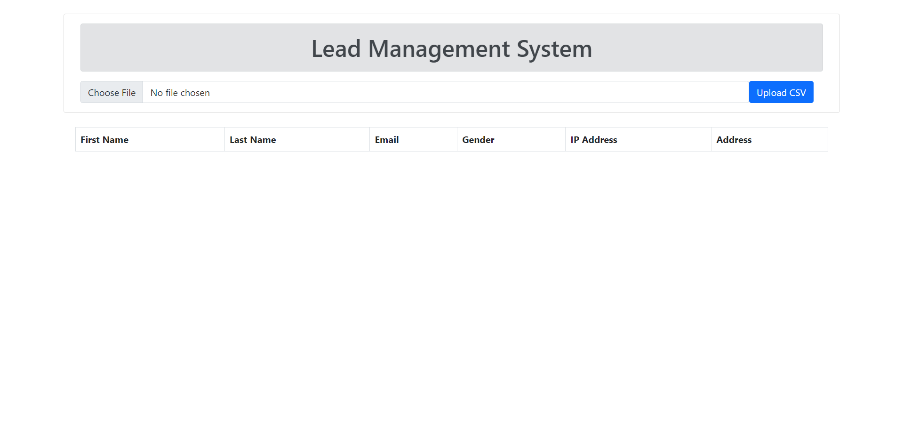
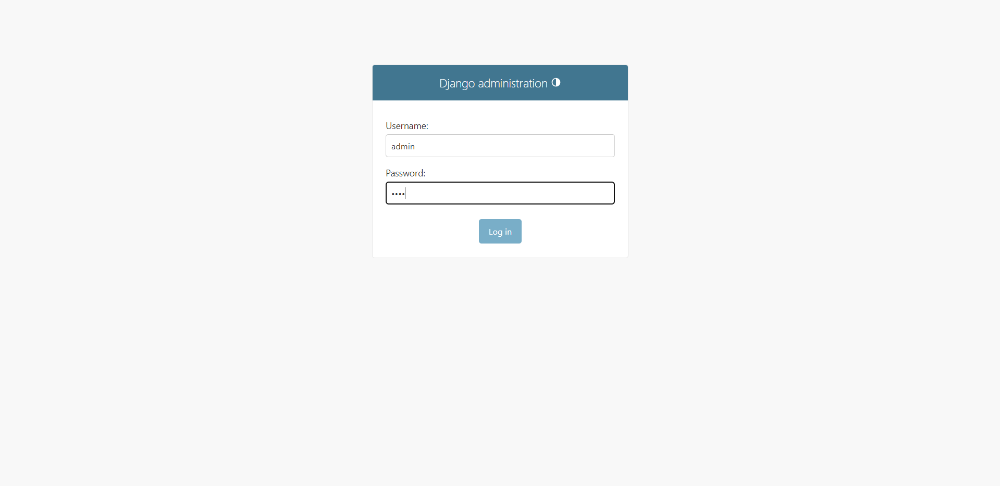
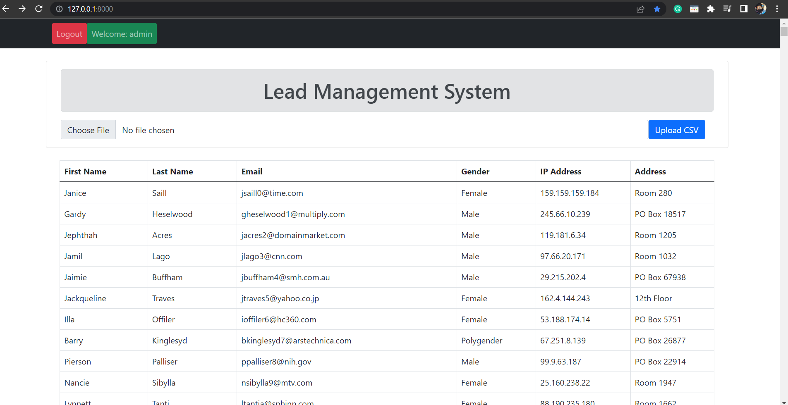
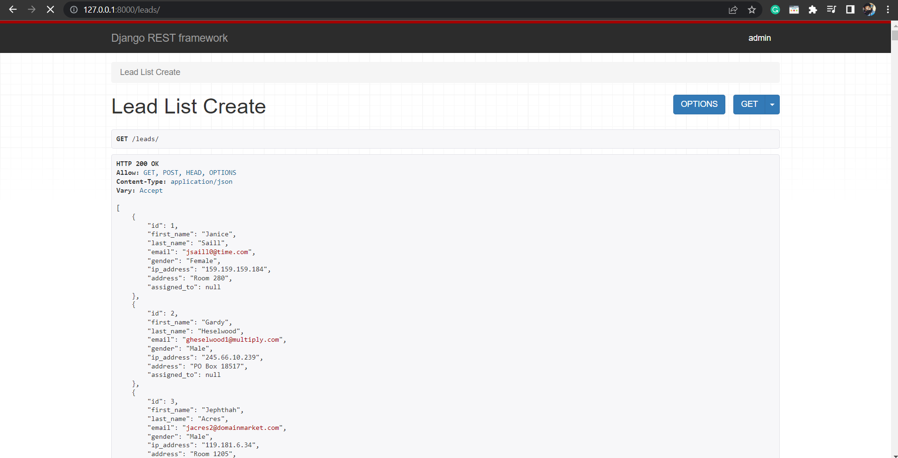
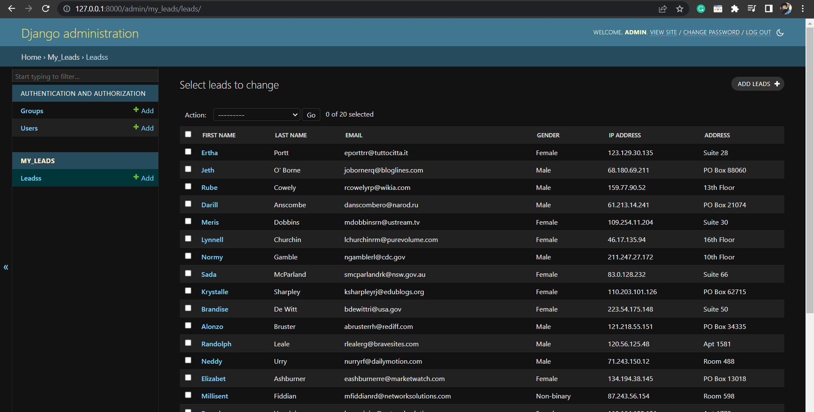
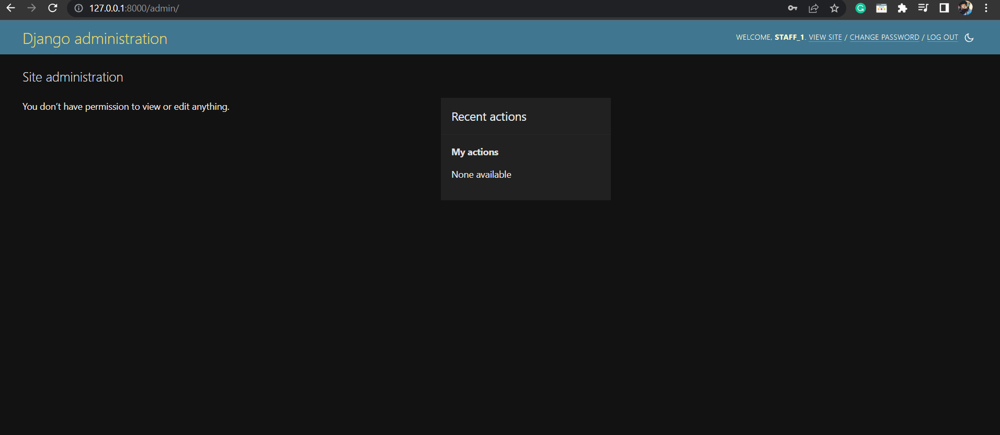

#  Lead management system using Django Rest Framework 

* Install All Dependencies
    * Python 3.11.3
    * Django 4.2.1
    * Pandas 2.0.2
 

* Home Page Before Login

  
  

* This Login page admin site

  
  

* Home Page After Login
    * In This Page Have Two functionality
    * First Upload the CSV file  CSV data save it in the direct database
    *  Second all CSV data Fetch dynamically using Javascript
    *  Bootstrap V5.1 In This project uses CDN
  

  
  

  
* This Page Django Rest Framework (API)
  * In This Page Have Read and Create
    
  

  
* Admin Page
    
  

  
* This Page not access any other user without admin permission
    
  
  

    
